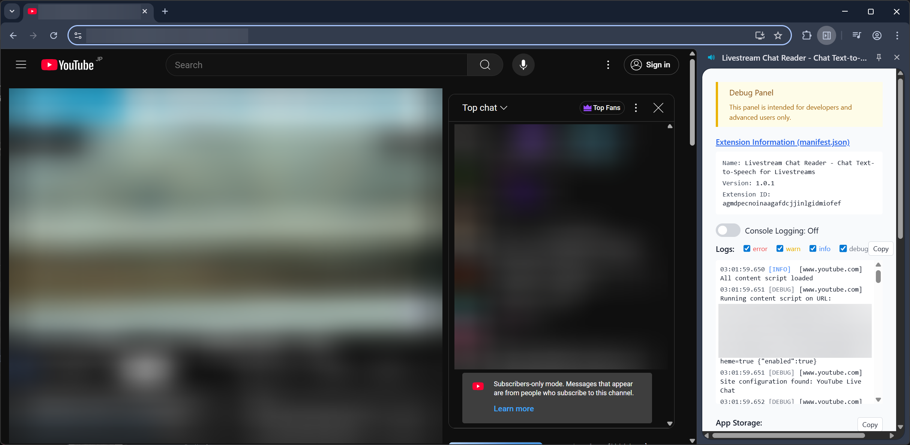

# Livestream Chat Reader

## Development

I recommend using VS Code Dev Containers for development of this extension. Start the dev container, then run `bun dev` to launch the development server and build the extension. Once the extension is built, install the extension to your browser by loading the unpacked extension built to the `.output/chrome-mv3` directory.  
*For detailed installation steps, you can also refer to the [Chrome extension installation guide](https://github.com/Jonghakseo/chrome-extension-boilerplate-react-vite#for-chrome-).*

Alternatively, you can launch Chrome with the extension installed by removing the `webExt.disabled: true` property in [`wxt.config.ts`](wxt.config.ts).

For production builds, use `bun run build` to build an optimized version or `bun zip` to build and create a zip file for distribution.

### Note

- There is a debug interface in side panel. Click "Open side panel" from the extension menu to access it.  
  
- If you want to develop Chrome extensions on your own, you should check out [WXT](https://github.com/wxt-dev/wxt) in addition to [Chrome Extension Boilerplate](https://github.com/Jonghakseo/chrome-extension-boilerplate-react-vite) (which this project uses).
- The test screen for end-user is also used by automated E2E testing (`bun e2e -- --spec=specs/page-content.test.ts`).

## License

This Chrome extension is licensed under the [MIT License](LICENSE).  
The boilerplate used in this project ([Jonghakseo/chrome-extension-boilerplate-react-vite](https://github.com/Jonghakseo/chrome-extension-boilerplate-react-vite)) is also licensed under the [MIT License](LICENSE.boilerplate).
